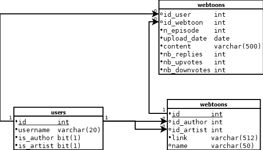

# Webtoon Stats
Un projet permettant d'afficher des statistiques sue les commentaires d'un webtoon donné.

## :x: Etat actuel du projet
Ce projet n'est pas fonctionnel actuellement.
Un changement récent dans la structure du site Webtoon a cassé le scraping via Selenium. Un mise à jour du script de scraping est nécessaire.

##  Aperçu de la base de donnée

## Utilisation

### 1. Prérequis:
- Chrome installé
- XAMPP installé

### 2. Créer la base de donnée
- ouvrir phpMyAdmin depuis XAMPP
- créer son utilisateur
- créer la base de donnée "webtoon_scraping"
- ajouter les tables avec le sql dans "sql_skeleton.txt"
- ajouter ses identifiants à "init_database.py"
- lancer "init_database.py"

### 3. Lancer le serveur
- placer webtoon_stats.php, les fichiers css et javascript dans htdocs/

L'application sera accessible sue localhost/webtoon_stats

